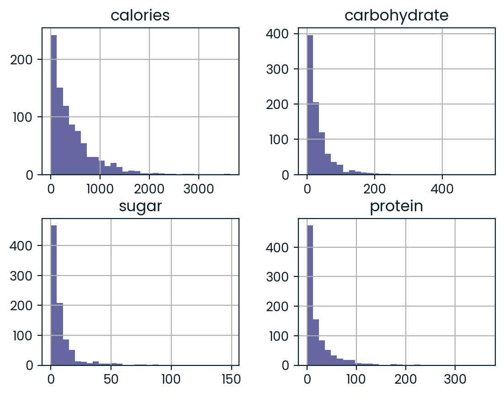
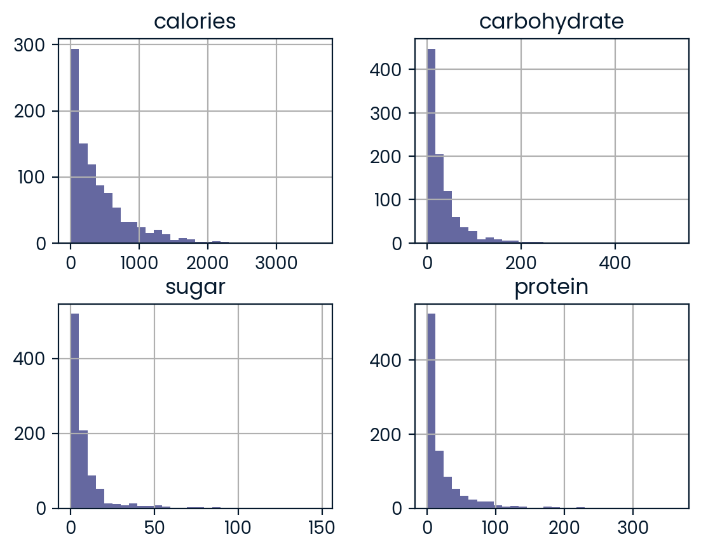
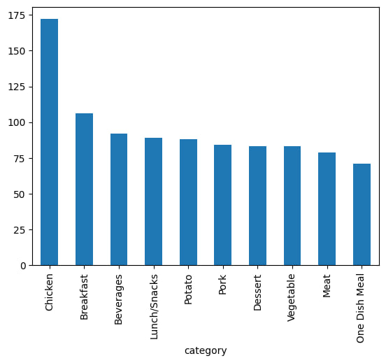
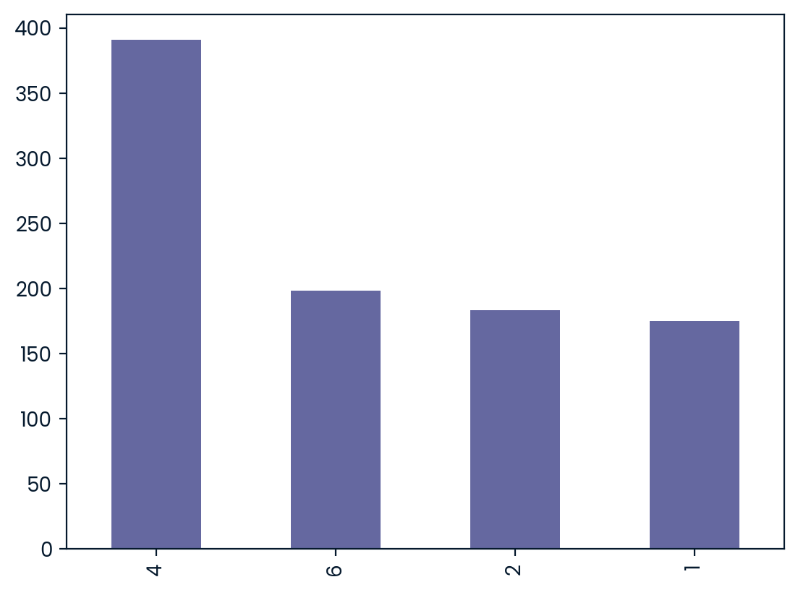
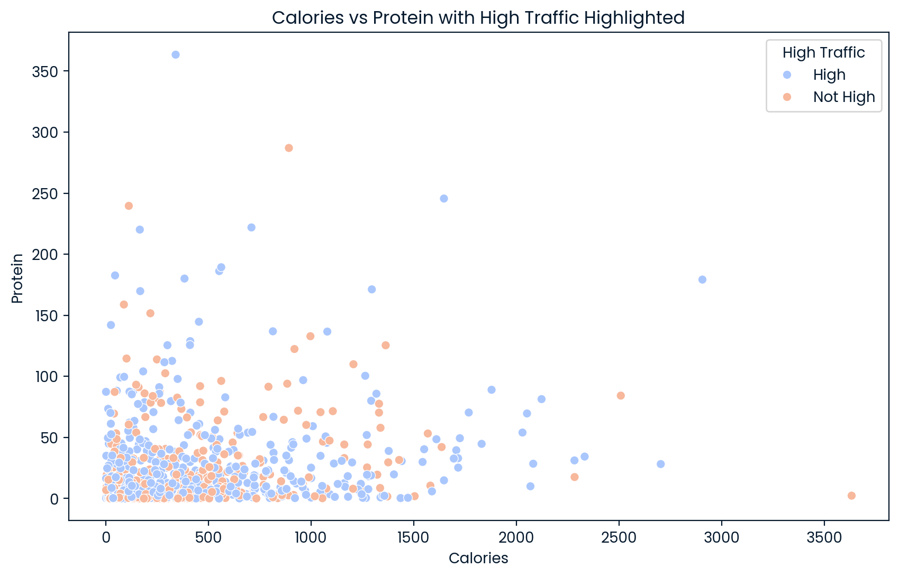
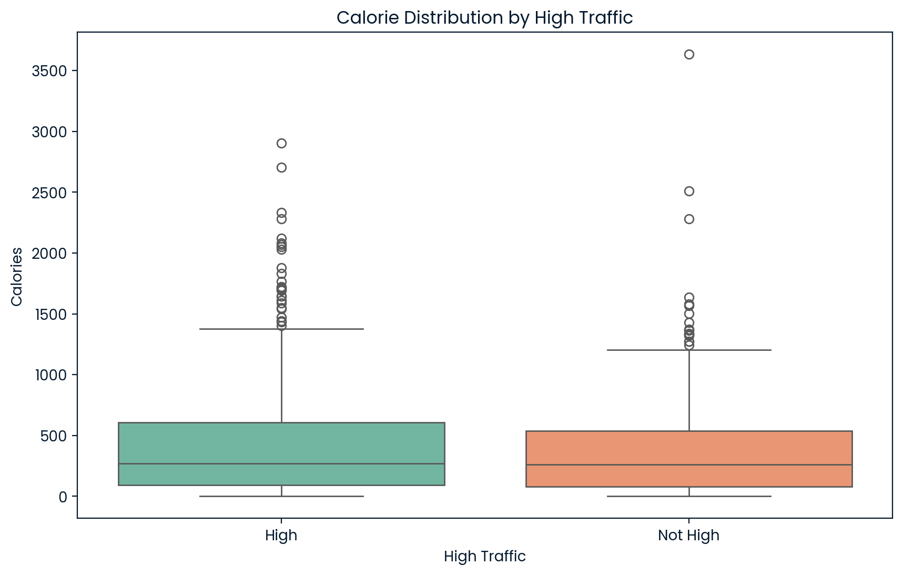
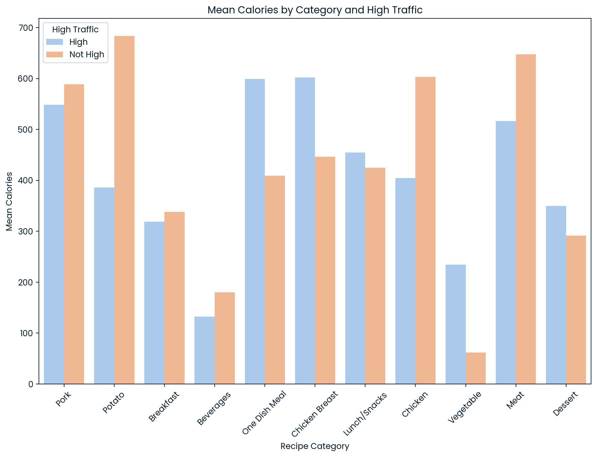

- Data Validation:
  - Columns 'calories', 'carbohydrates', 'sugar', 'protein' are numeric columns that each had 52 missing value simultaniusly in the same entries; As this was more than 5% of the total data, decision to impute data was made using median, because data was skewed to the right; Later for the model this data was standartized using log1p function.
  - Column 'category' didn't have any missing values and data was consistent, so no changes were made, except getting dummy values for the model later.
  - Column 'servings' didn't have any missing values, though had 3 values that were not consistent with the rest of the dataset. Those values were easy to identify as the other categories, and they were replaced for the right categories. Also datatype of the column was different in the description of the dataset, so the column was converted to the right datatype, eventhough the column has a categorical logicallity. 
  - Column 'high_trafic' is a target variable, and had two unique values: High and None with a ratio of values to be 574/373. None values were replaced with Not High value. Later were mapped to be 1 and 0 for High and Not High values respectfully.

- Exploratory Analysis:

Skewed to the right numerical columns before and after of the imputation of the missing values. There is almost no difference in the graphs, which means that imputation was carried out correctly.

The values are reasonably well-distributed across the categories, with none dominating excessively. Also categories are consistent with given dataset description. 

Column has a significant dominance of category '4 servings', while other categories are simingly balanced.

Here can be seen that the majority of data is situated on the bottom left of the graph, with few clear outliers being seen on the outside of the main data. 

Here can be seen that not a big difference in calories distribution between High and Not High traffic.

Here can be ssen that for some categories like Chicken, Potato, Meat mean of calories tends to be higher for the High traffic rather then for Not High traffic. 

- Model Development:
  - Problem type: predicting whether a recipe will receive high traffic or not. This is a binary classification problem, where the target variable "high_traffic" has two classes: 1-High Traffic and 0-Not High Traffic. The goal is to identify high-traffic recipes.
  - Logistic Regression:  reasoning - it is a straightforward algorithm, which makes it easy to interpret and explain results through feature importance. Also, it is quite good in handling features like, categorical encoding and binary data.
  - Random Forest: reasoning - can capture some existing non-linear relationship between features and target value. Although it does not require scaling, it was decided to use scaled data antways.

- Model Evaluation:
  - Logistic Regression: Accuracy = 77.3%; Class High-traffic or 1 has precision of 77%, recall of 82% resulting in f1-score of 79%; While class Not High-traffic or 0 has a precision of 75%, recall of 66% resulting in f1-score of 70%. This model has a strong recall and F1-score for high traffic recipes, making it quite good for predicing high traffic recipes.
  - Random Forest: Accuracy 73.6% by optimisation in Grid-searched technic for optimal hyperparameters; Class High-traffic or 1 has precision of 76%, recall of 82% resulting in f1-score of 79%; While class Not High-traffic or 0 has a precision of 70%, recall of 61% resulting in f1-score of 65%. Eventhough, the ability of this model to correctly predict high-traffic category on the same level as in Logistic Regression, it predicts not high-traffic category worse, resulting in smaller accuracy score. So, despite its ability to capture non-linear relationships, Rendom Forest performs slightly worse overall in terms of accuracy, precision, and recall

- Business Metrics:
The goal is to identify recipes likely to generate high-traffic or Class 1, as these recipes may lead to more revenue as user engagement might be increased, so they will see more ads on the site, subscribe and etc. However misclassifying a high traffic recipe as low traffic or having a false negative could mean a lost opportunity, while in opposite having a false positive or, in other words, incorrectly labeling a low traffic recipe as high traffic may waste resources promoting less valuable recipes, leading to lower revenue.
To evaluate models performances money-wise we can set some dummy money-values for results of model performance. For example: False Negative (FN) = 250 - here a lot more of lost potential then in FP, False Positive (FP) = 10, True Positive (TP) = 500, while True Negative (TN) = 100 as it is a prevention of lost potential. Therefore, Profit = (TP * 500) + (TN * 100) − (FP * 10) − (FN * 250). Calculating for Logistic Regression, where FN=17 FP=26 TP=96 TN=51 : Profit = 48590. Calculating for Random Forest, where FN=20 FP=30 TP=93 TN=47 : Profit =  45900.

Logistic Regression achieves a slightly higher profit - 48,590 compared to Random Forest - 45,900. This is because of Logistic Regression having fewer false positives and having a slightly better precision. So, Logistic Regression yields higher business value due to fewer false positives and has to used if the decision is buiseness driven.

- Final summary including recommendations that the business should undertake:
  - Logistic Regression is the preferred model due to its better accuracy, precision, and ease of interpretability, particularly for business contexts prioritizing high traffic recipes.
  - Categories like Vegetable, Dessert, and Breakfast significantly increase the likelihood of high traffic.
  - Nutritional factors such as higher carbohydrate and protein levels positively influence traffic, while high calories and sugar tend to reduce traffic.
  - Recipes in Beverages and Meat categories are less likely to attract high traffic.
  - Buiseness should promote recipes in categories that attract high traffic, and simultaniously looking to optimize calorie values for attracting high traffic.
  - Should also continue collecting data, to further develop model and collecting more insights.